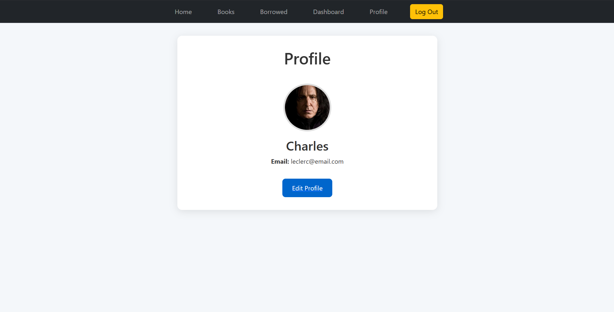

# 📚 Personal Library Management System


> This project is a web-based application to help you **manage and track your personal book collection**. You can add books, search and browse your library, record borrowing activity, and even manage e-books.

## 📑 Table of Contents

- [Overview](#-overview)
- [Technologies Used](#-technologies-used)
- [Planning & Design](#-planning--design)
  - [Wireframes](#-wireframes)
  - [ERD (Entity Relationship Diagram)](#-erd-entity-relationship-diagram)
- [Getting Started](#-getting-started)
- [Features](#-features)
- [Usage](#-usage)
- [User Stories](#-user-stories)
- [Screenshots](#-screenshots)
- [Future Updates](#-future-updates)
- [Credits](#-credits)

## 📖 Overview

The Personal Library Management System enables users to:

- 📘 Add and manage books (physical + digital)
- 🔍 Search and filter their library
- 🔁 Track borrowing and return records
- 🛠 Access admin dashboard for control
- 🔐 Use user authentication for security

## 🛠 Technologies Used

- **Frontend:** HTML, CSS, JavaScript
- **Backend:** Node.js, Express.js
- **Templating:** EJS
- **Database:** MongoDB

## 🧠 Planning & Design

### 🖼 Wireframes

[📎 View wireframes](#) _(link to PDF or Figma)_

### 🗂 ERD (Entity Relationship Diagram)

[📎 View ERD](#) _(link to image or diagram tool)_

## 🚀 Getting Started

### 🧰 Prerequisites

- Node.js v18+
- npm or yarn
- MongoDB (local or Atlas)
- Git

### 📦 Installation

```bash
git clone https://github.com/yourusername/personal-library-app.git
cd personal-library-app
npm install
```

### ⚙️ Setup Environment

```
PORT=3010
MONGO_URI= <mongodb connection string>
SESSION_SECRET=<add your session secret>
```

## ✅ Features

- 🔖 **Book Management:** Add, edit, and view your books
- 🔁 **Borrow & Return:** Track borrowed/returned status
- 📥 **E-Book Support:** Upload and download PDF books
- 🔍 **Search:**Filter by title
- 🔐 **User Authentication:** Register and log in
- 🛠 **Dashboard:** See how many books you have in each genre.

## 👤 User Stories

### 📘 Book Management

- As a user, I want to add books to my personal collection so that I can keep track of all the books I own.

- As a user, I want to edit book details so that I can correct or update information like title, author, or genre.

- As a user, I want to view a list of all my books so that I can browse through my collection easily.

- As a user, I want to delete books so that I can correct errors or remove outdated information.

### 🔄 Borrow & Return Tracking

- As a user, I want to mark a book as borrowed so that I can track which books are currently lent out.

- As a user, I want to see who borrowed a book and when so that I know when to expect it back.

- As a user, I want to mark a book as returned so that my collection stays up-to-date.

### 🔄 Borrow & Return Tracking

- As a user, I want to mark a book as borrowed so that I can track which books are currently lent out.

- As a user, I want to see who borrowed a book and when so that I know when to expect it back.

- As a user, I want to mark a book as returned so that my collection stays up-to-date.

### 📥 E-Book Support

- As a user, I want to upload e-books to my collection so that I can store and organize digital books.

- As a user, I want to download e-books from my library so that I can read them on my devices.

### 🔐 User Authentication

- As a new user, I want to register for an account so that I can have a private, secure personal library.

- As a returning user, I want to log in with my credentials so that I can access my library securely.

## 🖼 Screenshots




## 🚧 Future Updates

- [] 📊 User reading stats

- [] 📂 Book category filters

- [] 🧾 Export books to PDF/CSV

- [] ⏰ Borrowing due date reminders
